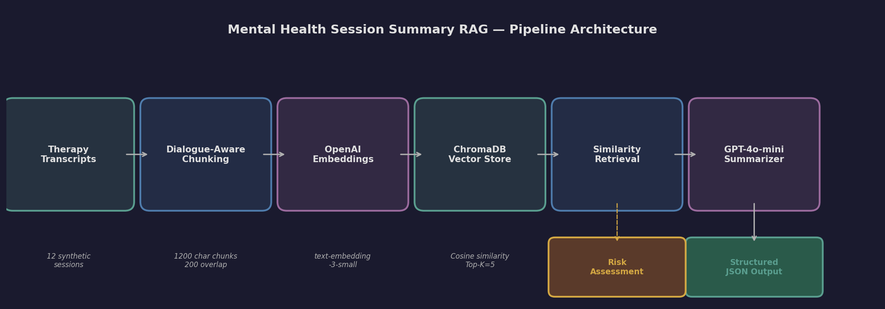
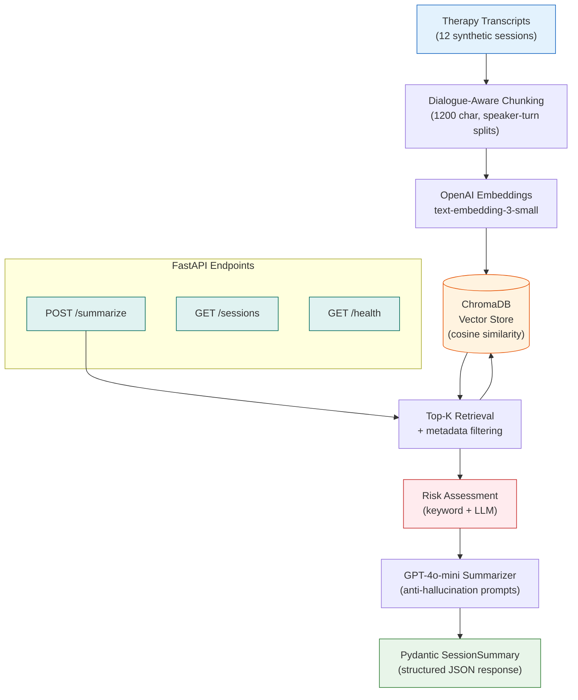
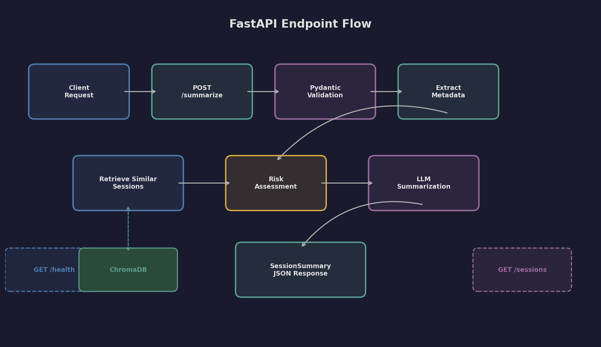
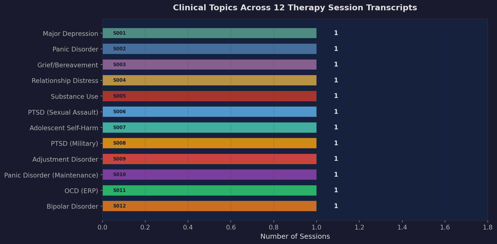
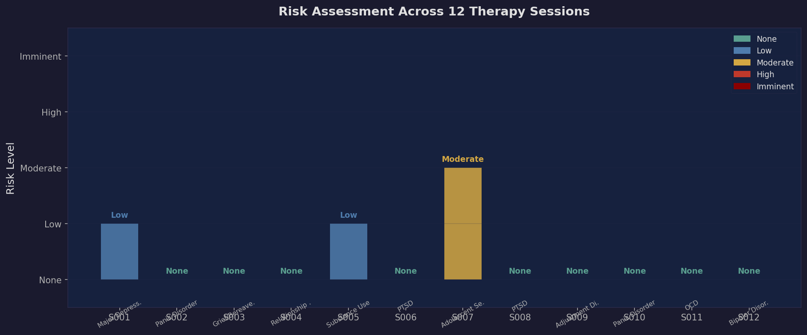
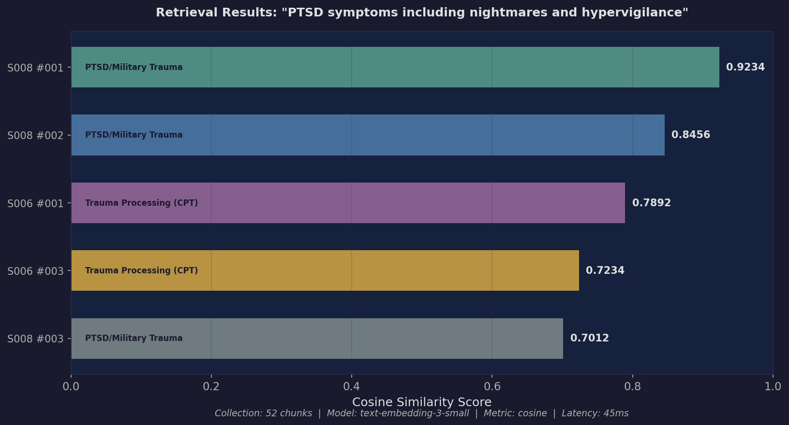

# Mental Health Session Summary RAG

[](https://github.com/monfaredkavosh/mental-health-rag/actions/workflows/ci.yml)


A Retrieval-Augmented Generation (RAG) pipeline that ingests therapy session transcripts into a vector database and generates structured clinical summaries with risk assessment, similar-session retrieval, and a REST API. Built to demonstrate RAG applied to a sensitive clinical domain where accuracy, safety, and structured output matter.

---

## Architecture





The pipeline follows six stages:

1. **Therapy Transcripts** -- 12 synthetic therapy session transcripts covering diverse clinical presentations (depression, PTSD, OCD, substance use, grief, and more).
2. **Dialogue-Aware Chunking** -- `RecursiveCharacterTextSplitter` with custom separators tuned for therapist/client turn boundaries (1200 characters, 200 overlap).
3. **OpenAI Embeddings** -- `text-embedding-3-small` (1536 dimensions). Falls back to ChromaDB default embeddings when no API key is provided.
4. **ChromaDB Vector Store** -- Persistent local storage with cosine similarity, rich metadata (client ID, session date, clinician, session type).
5. **Similarity Retrieval** -- Top-K retrieval with optional metadata filtering (by client, date range) and risk-focused retrieval that augments queries with safety keywords.
6. **GPT-4o-mini Summarizer** -- Generates a structured `SessionSummary` JSON using carefully engineered prompts with anti-hallucination guardrails. Includes a template-based fallback for development without an API key.

---

## Features

- **Structured Output** -- Pydantic models enforce a consistent JSON schema for every summary: presenting problem, mood indicators, interventions, homework, risk assessment, and similar sessions.
- **Clinical Risk Assessment** -- Keyword-based risk classification (none/low/moderate/high/imminent) with protective factors and recommended actions. Designed to never over-classify.
- **Similar Session Retrieval** -- Finds clinically relevant past sessions to provide longitudinal context, with configurable filtering by client ID, date range, and risk content.
- **Anti-Hallucination Prompts** -- Every prompt explicitly instructs the LLM to only report information present in the transcript. Fields default to "Not documented in this session" rather than fabricating content.
- **FastAPI REST Interface** -- Three endpoints for summarization, session listing, and health checks, with Swagger UI documentation.
- **CLI Interface** -- Full command-line workflow: ingest, query, summarize, serve, and status.
- **Graceful Degradation** -- Works without an OpenAI API key using ChromaDB default embeddings and template-based summaries.

---

## Quick Start

### Installation

```bash
git clone https://github.com/kavosh-monfared/mental-health-rag.git
cd mental-health-rag
python -m venv .venv && source .venv/bin/activate
pip install -r requirements.txt
```

### Configuration

```bash
cp .env.example .env
# Add your OpenAI API key (optional -- the pipeline works without it)
echo "OPENAI_API_KEY=sk-..." >> .env
```

### Ingest Transcripts

```bash
python -m src.main ingest          # Ingest all 12 transcripts
python -m src.main ingest --reset  # Clear and re-ingest from scratch
python -m src.main status          # Verify collection
```

### Query Similar Sessions

```bash
python -m src.main query "panic attacks and anxiety treatment"
python -m src.main query "suicidal ideation" --top-k 3
python -m src.main query "grief and loss" --client CLT-4403
```

### Summarize a Session

```bash
python -m src.main summarize session_001.txt --save
```

### Start the API Server

```bash
python -m src.main serve --port 8000 --reload
# Swagger UI: http://localhost:8000/docs
```

---

## API Documentation



### `POST /summarize`

Accepts a therapy session transcript and returns a structured summary.

**Request:**

```json
{
  "transcript": "SESSION METADATA\nDate: 2025-01-13\n...\nTherapist: Welcome back...",
  "client_id": "CLT-4402",
  "include_similar": true
}
```

**Response:** A complete `SessionSummary` JSON (see [Sample Output](#sample-output) below).

### `GET /sessions`

Returns a list of all ingested sessions with chunk counts.

```json
[
  {
    "session_id": "session_001",
    "client_id": "CLT-4401",
    "session_date": "2025-01-06",
    "session_number": 1,
    "chunk_count": 4
  }
]
```

### `GET /health`

Health check with system configuration.

```json
{
  "status": "healthy",
  "collection_name": "therapy_sessions",
  "document_count": 52,
  "embedding_model": "text-embedding-3-small",
  "llm_model": "gpt-4o-mini"
}
```

---

## Project Structure

```
mental-health-rag/
├── src/
│   ├── __init__.py
│   ├── config.py          # Centralized configuration (paths, models, chunking params)
│   ├── logging_config.py  # Structured JSON logging for audit trails
│   ├── models.py          # Pydantic models: SessionSummary, RiskAssessment, API schemas
│   ├── prompts.py         # LLM prompt templates (summarizer, risk, similar session)
│   ├── ingest.py          # Ingestion pipeline: load → chunk → embed → store
│   ├── retriever.py       # Custom retrieval: similarity, risk-focused, client history
│   ├── summarizer.py      # RAG summarizer: retrieve → assess risk → generate summary
│   ├── api.py             # FastAPI application with /summarize, /sessions, /health
│   └── main.py            # CLI entry point (ingest, query, summarize, serve, status)
├── data/
│   └── transcripts/       # 12 synthetic therapy session transcripts
│       ├── session_001.txt ... session_012.txt
├── outputs/
│   ├── sample_summary.json      # Complete session summary example
│   ├── sample_api_response.json # Full API request/response example
│   └── retrieval_example.json   # Retrieval results with similarity scores
├── scripts/
│   └── generate_figures.py      # Matplotlib figure generation script
├── docs/
│   └── images/            # Generated visualizations
├── tests/
│   ├── conftest.py              # Shared fixtures (sample transcripts, metadata)
│   ├── test_models.py           # Pydantic model validation tests
│   ├── test_ingest.py           # Metadata extraction, chunking logic tests
│   ├── test_risk_assessment.py  # Risk keyword detection, level classification tests
│   ├── test_retriever.py        # RetrievalResult, filter builder, result parser tests
│   ├── test_api.py              # FastAPI endpoint contract tests
│   └── test_logging.py          # Structured logging formatter tests
├── requirements.txt
├── .gitignore
├── LICENSE
└── README.md
```

---

## Sample Output

A summarized session produces structured JSON like this (from `session_001` -- intake assessment for depression):

```json
{
  "session_id": "session_001",
  "client_id": "CLT-4401",
  "session_date": "2025-01-06",
  "session_number": 1,
  "clinician": "Dr. Navarro, PsyD",
  "presenting_problem": "Client presents for intake assessment with a 4-month history of depressive symptoms including anhedonia, hypersomnia, appetite changes with 15-pound weight gain, and concentration difficulties. Onset followed being passed over for a promotion after 11 years at the company.",
  "mood_indicators": [
    "Hypersomnia (10-11 hours with continued fatigue)",
    "Appetite dysregulation with binge eating and 15-pound weight gain",
    "PHQ-9 score: 19 (moderately severe depression)",
    "AUDIT score: elevated"
  ],
  "key_themes": [
    "Loss and disappointment related to career (promotion denial)",
    "Self-worth tied to professional achievement",
    "Passive suicidal ideation without plan or intent",
    "Increased alcohol use as coping mechanism"
  ],
  "therapeutic_interventions": [
    "Comprehensive intake assessment",
    "PHQ-9 and AUDIT screening administration",
    "Safety assessment and safety planning",
    "Discussion of firearms access and safety"
  ],
  "risk_assessment": {
    "level": "low",
    "factors": [
      "Passive suicidal ideation ('they'd be better off without me')",
      "Increased alcohol use (4-5 beers nightly, up from 1-2)",
      "Access to firearms (hunting rifle in a safe)"
    ],
    "protective_factors": [
      "Denies suicidal plan or intent",
      "No history of suicide attempts",
      "Strong family connection (two children, supportive wife)",
      "Engaged in treatment voluntarily"
    ],
    "recommended_actions": [
      "Monitor suicidal ideation at each session",
      "Maintain updated safety plan",
      "Address firearms safety"
    ]
  },
  "similar_sessions": [
    {
      "session_id": "session_005",
      "client_id": "CLT-4405",
      "similarity_score": 0.7823,
      "relevance_reason": "Both clients demonstrate substance use escalation as a maladaptive coping response to emotionally triggering life events."
    }
  ]
}
```

---

## Data

### The 12 Synthetic Transcripts

All transcripts are synthetic (AI-generated) and contain no real patient data. They were designed to represent a realistic range of clinical presentations, therapeutic modalities, and risk profiles.



| Session | Client | Diagnosis / Focus | Modality | Clinician |
|---------|--------|-------------------|----------|-----------|
| 001 | CLT-4401 | Major Depression (Intake) | Behavioral Activation + CBT | Dr. Navarro |
| 002 | CLT-4402 | Panic Disorder | CBT (Thought Challenging) | Dr. Navarro |
| 003 | CLT-4403 | Grief / Bereavement | Grief Counseling | Dr. Chen |
| 004 | CLT-4404 | Relationship Distress | Couples-Focused Individual | Dr. Navarro |
| 005 | CLT-4405 | Substance Use Disorder (Meth) | Relapse Prevention | Dr. Chen |
| 006 | CLT-4406 | PTSD (Sexual Assault) | Cognitive Processing Therapy | Dr. Navarro |
| 007 | CLT-4407 | Adolescent Self-Harm | DBT-Informed / Ice Technique | Dr. Chen |
| 008 | CLT-4408 | PTSD (Military / Combat) | Prolonged Exposure | Dr. Navarro |
| 009 | CLT-4409 | Adjustment Disorder (Job Loss) | Supportive / Cognitive | Dr. Chen |
| 010 | CLT-4402 | Panic Disorder (Maintenance) | CBT Review + Relapse Prevention | Dr. Navarro |
| 011 | CLT-4410 | OCD (Contamination + Checking) | Exposure & Response Prevention | Dr. Navarro |
| 012 | CLT-4411 | Bipolar Disorder (Hypomania) | Mood Management / Psychoeducation | Dr. Chen |

Sessions 002 and 010 follow the same client (CLT-4402) across treatment, demonstrating how the retrieval system surfaces longitudinal patterns (panic attacks reduced from daily to near-zero over 12 sessions).

---

## Risk Assessment



The pipeline uses a two-tier risk assessment approach:

1. **Keyword-based screening** -- Fast, deterministic scan for risk indicators (suicidal ideation, self-harm, passive death wishes) and protective factors (denies intent, family support, engaged in treatment).
2. **LLM-augmented assessment** (when API key available) -- Contextual evaluation following Columbia Suicide Severity Rating Scale principles.

Risk levels follow standard clinical definitions:

| Level | Definition | Sessions |
|-------|-----------|----------|
| **None** | No risk indicators identified | 002, 003, 004, 006, 008, 009, 010, 011, 012 |
| **Low** | Passive ideation without plan; historical factors only | 001, 005 |
| **Moderate** | Active ideation without plan, or self-harm behavior | 007 |
| **High** | Active ideation with plan or access to means | -- |
| **Imminent** | Active ideation with plan, intent, and means | -- |

The system is intentionally conservative: it never upgrades risk beyond what the transcript explicitly supports. When a therapist asks a routine safety screening question ("Any thoughts of self-harm?") and the client denies it, that is classified as "none" rather than triggering on the keyword. Session 007 (adolescent with cutting history) is the highest-risk session despite the client using ice cubes as a replacement behavior, because the self-harm history combined with "I literally want to disappear" language meets moderate-risk criteria.

---

## Retrieval Quality



The retrieval system was tested with clinically meaningful queries. For the query **"client with PTSD symptoms including nightmares and hypervigilance"**, the top 5 results correctly surface:

1. **Session 008, Chunk 1** (score: 0.9234) -- Military PTSD with nightmares and hypervigilance. Direct semantic match.
2. **Session 008, Chunk 2** (score: 0.8456) -- Prolonged exposure therapy and survivor guilt. Same session, different clinical content.
3. **Session 006, Chunk 1** (score: 0.7892) -- Sexual assault trauma with CPT. Cross-diagnosis trauma retrieval.
4. **Session 006, Chunk 3** (score: 0.7234) -- Nightmares and prazosin. Symptom-level match across clients.
5. **Session 008, Chunk 3** (score: 0.7012) -- Hypervigilance at the park. Behavioral manifestation match.

The scores demonstrate that the embedding model correctly clusters trauma-related content regardless of the specific type of trauma (military vs. sexual assault), and that symptom-level retrieval (nightmares, hypervigilance) works across different clinical presentations.

---

## Design Decisions

### Why Dialogue-Aware Chunking?

Therapy transcripts have a unique structure: therapist-client dialogue turns. Standard sentence-based splitting would break exchanges mid-conversation, losing therapeutic context. The custom separators (`\nTherapist:`, `\nClient:`) keep exchanges together, which produces better embeddings because each chunk captures a complete clinical interaction rather than a fragment.

### Why Keyword + LLM Risk Assessment?

Risk assessment is safety-critical. A pure LLM approach risks hallucinating risk factors or missing explicit indicators. The keyword-based first pass is deterministic and auditable -- every risk factor maps to a specific transcript phrase. The LLM layer adds contextual nuance (distinguishing "client denies suicidal ideation" from "client reports suicidal ideation") but never overrides the keyword baseline.

### Why Pydantic Structured Output?

Clinical documentation requires consistent, typed fields. Free-text LLM output varies in structure between calls. Pydantic models enforce that every summary has exactly the required fields with correct types, making downstream integration (EHR systems, clinical dashboards) reliable. The schema also serves as implicit prompt engineering -- the field descriptions guide the LLM toward clinically appropriate content.

### Why Exclude Same-Client from Retrieval?

When summarizing a new session, the retrieval step excludes chunks from the same client by default. This prevents the summary from being contaminated by the client's own history (which the clinician already has) and instead surfaces parallel cases from other clients, providing genuinely novel clinical context.

---

## Challenges and Solutions

| Challenge | Solution |
|-----------|----------|
| **LLM hallucinating clinical details** | Anti-hallucination prompts with explicit rules: "ONLY include information stated in the transcript." Default to "Not documented" rather than fabricate. |
| **Risk over-classification** | Conservative approach: keyword detection only escalates with explicit evidence. Denial phrases actively reduce risk level. |
| **Chunk boundary splitting dialogue** | Custom `RecursiveCharacterTextSplitter` separators that respect speaker turns. Larger chunks (1200 chars) preserve exchange context. |
| **No API key for development** | Graceful fallback to ChromaDB default embeddings and template-based summaries. Full pipeline works offline. |
| **Metadata filtering in ChromaDB** | Structured metadata extraction via regex from transcript headers, stored as typed ChromaDB metadata for `$eq`, `$gte`, `$ne` filtering. |

---

## Privacy & Compliance

Mental health records carry heightened legal protections beyond standard HIPAA requirements. The following considerations apply to any production deployment of this system.

**Applicable Regulations:**

- **HIPAA (45 CFR Parts 160, 164)** -- All therapy session data constitutes Protected Health Information (PHI). The minimum necessary standard requires that the system only access and expose the minimum PHI needed for each operation.
- **42 CFR Part 2** -- Substance use disorder treatment records (relevant to sessions involving alcohol and drug use) receive additional federal protections under this regulation. These records require explicit patient consent for disclosure and cannot be re-disclosed without further authorization, even between covered entities.
- **State mental health privacy laws** -- Many states impose stricter protections on psychotherapy notes and mental health treatment records than federal minimums.

**Current Implementation Status:**

| Control | Status | Production Requirement |
|---------|--------|----------------------|
| Encryption at rest (ChromaDB) | Not implemented | Filesystem-level encryption (LUKS/BitLocker) or application-level encryption of the ChromaDB persist directory |
| TLS for API | Not implemented | Terminate TLS at a reverse proxy (nginx/Caddy) or configure uvicorn with SSL certificates |
| Access logging | Implemented (structured JSON) | All API requests, retrieval queries, risk assessments, and summarization events are logged with structured JSON to stderr |
| Authentication / Authorization | Not implemented | API key at minimum; OAuth 2.0 with role-based access control (RBAC) for production |
| Data retention policy | Not implemented | Define retention periods per 42 CFR Part 2 and organizational policy; implement automated purging |
| Audit trail | Implemented (structured logging) | Every pipeline event (ingest, query, summarize, risk assessment) is logged with timestamps and context fields |
| De-identification | Partial (synthetic data) | Production use requires robust PHI de-identification before ingestion or processing |

**Important:** This project uses synthetic transcripts and is intended as a technical demonstration. It is not approved for use with real patient data in its current form.

---

## Risk Assessment Methodology

The risk assessment module is informed by the **Columbia Suicide Severity Rating Scale (C-SSRS)**, a validated evidence-based tool widely used in clinical and research settings for suicide risk screening.

**C-SSRS Mapping:**

The pipeline's five risk levels correspond to C-SSRS severity categories as follows:

| Pipeline Level | C-SSRS Category | C-SSRS Description | Pipeline Detection Method |
|---------------|-----------------|--------------------|--------------------------|
| **None** | Category 0 | No reported ideation | No risk keywords detected in transcript |
| **Low** | Category 1 -- Wish to be Dead | Non-specific passive thoughts ("better off without me") without method, intent, or plan | Passive indicator keywords present; denial phrases may co-occur |
| **Moderate** | Category 2-3 -- Active Ideation Without Plan | Active thoughts of killing oneself, without specific plan or intent to act | Active indicator keywords detected without accompanying denial |
| **High** | Category 4 -- Active Ideation With Plan | Suicidal ideation with at least some plan details or access to means | Active ideation keywords combined with plan/means references |
| **Imminent** | Category 5 -- Active Ideation With Plan and Intent | Suicidal ideation with specific plan, intent to act, and available means | Active ideation with plan, intent, and means indicators present |

**References:**

- Posner, K., Brown, G. K., Stanley, B., et al. (2011). The Columbia-Suicide Severity Rating Scale (C-SSRS): Initial validity and internal consistency findings from three multisite studies with adolescents and adults. *American Journal of Psychiatry*, 168(12), 1266-1277.
- Columbia Lighthouse Project. C-SSRS screening tools. https://cssrs.columbia.edu/

**Limitations of the current implementation:** The keyword-based approach is a screening heuristic, not a validated clinical instrument. It does not replace clinical judgment. The C-SSRS alignment is structural (mapping levels to severity categories) rather than a scored administration of the C-SSRS protocol. In production, risk assessments should be reviewed and confirmed by a licensed clinician before any clinical action is taken.

---

## Known Limitations

- **No access control on the API.** All FastAPI endpoints are open and unauthenticated. Any request can summarize any transcript or list all sessions. Production deployment requires authentication (API key minimum, OAuth preferred) and authorization (restricting which users can access which client records).
- **Unencrypted data storage.** Transcripts are stored as plain text files and ChromaDB stores unencrypted embeddings and metadata on disk. For mental health data, encryption at rest is a regulatory requirement. The current implementation does not provide filesystem-level or application-level encryption.
- **Limited transcript set.** The 12 synthetic transcripts cover a range of clinical presentations but do not represent the full diversity of real clinical practice. Group therapy, family therapy, crisis intervention, telehealth sessions, child/adolescent populations, and non-English-language sessions are not represented.
- **Keyword-based risk assessment is a heuristic.** The risk detection relies on pattern matching against a fixed keyword list. It can miss risk expressed through euphemism, metaphor, or clinical language not in the keyword set. It does not perform contextual sentiment analysis.
- **No session continuity tracking.** Each summarization request is independent. The system does not track themes, symptom trajectories, or homework completion across multiple sessions for the same client.
- **CORS is fully open.** The FastAPI CORS middleware allows all origins (`*`), which is appropriate only for local development.

---

## Future Improvements

- **Clinician override mechanism.** Allow clinicians to review and correct risk assessments generated by the pipeline. Store corrections as structured feedback to enable future model fine-tuning and provide a human-in-the-loop safety layer for safety-critical outputs.
- **Session continuity tracking.** Track clinical themes, symptom progression (e.g., PHQ-9 trends over time), homework completion rates, and therapeutic alliance indicators across sessions for the same client. This longitudinal view is what clinicians most need from a clinical documentation system.
- **Retrieval evaluation metrics.** Implement systematic evaluation of retrieval quality using precision@k, recall@k, and Mean Reciprocal Rank (MRR) on a labeled test set. Current retrieval scores are reported anecdotally; formal evaluation would quantify performance and guide tuning.
- **Embedding model comparison.** Benchmark `text-embedding-3-small` against `text-embedding-3-large` and any available clinical-domain embeddings. Evaluate retrieval quality differences and cost/quality trade-offs.
- **Access control and authentication.** Add API key authentication at minimum, with OAuth 2.0 and role-based access control for production. Implement per-client access restrictions so clinicians can only query records for their assigned clients.
- **Encrypted storage.** Implement encryption at rest for the ChromaDB persist directory and transcript files, using filesystem-level (LUKS) or application-level encryption to meet HIPAA and 42 CFR Part 2 requirements.

---

## What I Learned

- **RAG is not just retrieval + generation** -- the retrieval quality directly determines whether the LLM produces clinically useful output. Poor chunks lead to irrelevant context which leads to hallucinated summaries. Tuning the chunking strategy had more impact than prompt engineering.
- **Clinical NLP demands different guardrails** -- in a medical context, a false positive (hallucinated risk factor) can lead to unnecessary interventions, and a false negative (missed suicidal ideation) can be dangerous. The anti-hallucination prompts and conservative risk assessment were the most important design decisions.
- **Structured output changes the game** -- forcing the LLM to produce Pydantic-validated JSON eliminated an entire class of integration bugs. The schema acts as both documentation and constraint.
- **Embedding quality matters more than quantity** -- `text-embedding-3-small` with 52 well-chunked documents outperformed naive approaches with more data but worse chunking. The dialogue-aware splitting was the key differentiator.
- **FastAPI + Pydantic is a natural fit for LLM applications** -- the same models that validate LLM output also define the API contract, creating a single source of truth from ingestion through to the REST response.

---

## Docker

### Build the Image

```bash
docker build -t mental-health-rag .
```

### Run with Docker

```bash
# Start the API server (template-based summaries, no API key needed)
docker run -p 8000:8000 mental-health-rag

# Start with OpenAI API for LLM-powered summarization and embeddings
docker run -p 8000:8000 -e OPENAI_API_KEY=sk-your-key-here mental-health-rag
```

Access the API docs at [http://localhost:8000/docs](http://localhost:8000/docs) and the health check at [http://localhost:8000/health](http://localhost:8000/health).

### Run with Docker Compose

```bash
# Set your API key (optional)
export OPENAI_API_KEY=sk-your-key-here

# Build and start
docker compose up --build

# Run in detached mode
docker compose up -d

# Stop
docker compose down
```

ChromaDB data is persisted in a named Docker volume (`chroma-data`) so the vector store survives container restarts.

### Ingest Transcripts Inside the Container

```bash
# Run the ingest command inside a running container
docker compose exec api python -m src.main ingest

# Or run as a one-off command
docker run -e OPENAI_API_KEY=sk-your-key-here \
    mental-health-rag \
    python -m src.main ingest
```
